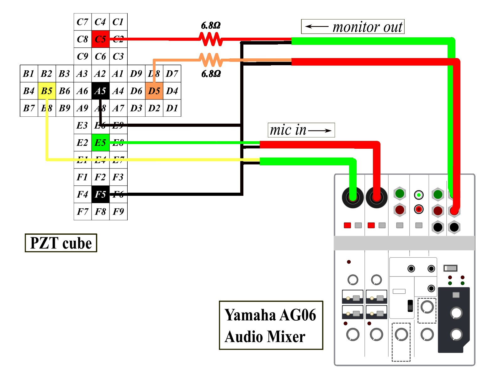

# cube

Experiments to determine the computational capability of a PZT reservoir.

## experiment 1

experiment 1 takes a single signal fed into both input faces. we then plot the output entropy as a function of input signal frequency.

## experiment 2

experiment 2 takes two signals fed into adjacent input faces, and the entropy of the cumulative output is measured. the conditional cross entropy is also calculated between the L and R channels of the output audio

